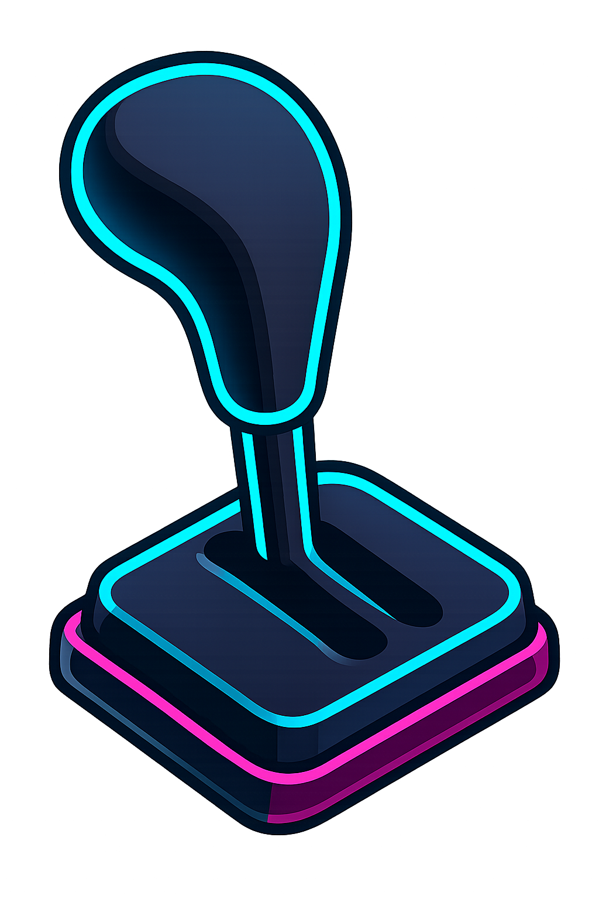

# VibeSwitch - Visual Overview

<p align="center">
  
</p>

**See your AI collaboration style in real-time.**

---

## 🎯 What You'll See

VibeSwitch adds **two visual indicators** to your Cursor status bar (bottom-right):

```
┌─────────────────────────────────────────────────────────────┐
│                                                             │
│                            📚 DEV  🟢 ▱▱▱▱▱▱▱              │
│                            └──┬──┘ └────┬─────┘             │
│                               │         │                   │
│                          Mode Indicator │                   │
│                                    Awareness Meter          │
└─────────────────────────────────────────────────────────────┘
```

---

## 1️⃣ Mode Indicator (Always Visible)

Shows your current collaboration mode:

### ⚡ VIBE Mode
```
⚡ VIBE
```
- **Meaning**: Autonomous flow, AI-driven
- **Click to**: Switch modes
- **Color**: Highlighted when active

### 📚 DEV Mode
```
📚 DEV
```
- **Meaning**: Collaborative control, human-driven
- **Click to**: Switch modes
- **Color**: Highlighted when active

### ⚙️ No Mode
```
⚙️ Mode?
```
- **Meaning**: First launch, no mode set
- **Click to**: Choose a mode

---

## 2️⃣ Awareness Meter (DEV Mode Only)

**The heart of VibeSwitch.** Shows how consciously you're working with AI.

### 🟢 Green (0-39%): Excellent Awareness
```
📚 DEV  🟢 ▱▱▱▱▱▱▱
```
**What it means:**
- You're reading AI code carefully
- You're rejecting questionable suggestions
- You're adapting code to your style
- **You're truly in control**

**Status:** This is what DEV mode should look like. Keep it up!

---

### 🟡 Yellow (40-59%): Moderate Trust
```
📚 DEV  🟡 ▰▰▰▰▱▱▱
```
**What it means:**
- You're accepting most suggestions quickly
- Some review, but not thorough
- Occasional edits, but mostly accepting as-is
- **You're coasting a bit**

**Warning:** You're between modes. Either slow down (true DEV) or switch to VIBE.

---

### 🟠 Orange (60-79%): High Trust
```
📚 DEV  🟠 ▰▰▰▰▰▰▱
```
**What it means:**
- Accepting AI code with minimal review
- Rarely rejecting suggestions
- Almost no adaptation or editing
- **You're barely in control**

**Alert:** You're acting like VIBE mode while claiming to be in DEV. Switch modes or slow down!

---

### 🔴 Red (80-100%): Blind Acceptance
```
📚 DEV  🔴 ▰▰▰▰▰▰▰
```
**What it means:**
- Zero critical thinking
- Instant acceptance without reading
- No edits, no rejections
- **You've lost control**

**Danger:** You're fooling yourself. This is VIBE mode behavior. Either switch to VIBE (honest) or wake up (real DEV).

---

## 🔄 How the Meter Updates

### Every 10 Seconds
The meter recalculates based on your **last 10 AI suggestions**:

```
Time: 0s ────────> 10s ────────> 20s ────────> 30s
       🟢 ▱▱▱▱▱▱▱    🟡 ▰▰▰▱▱▱▱    🟠 ▰▰▰▰▰▰▱
       (careful)     (coasting)     (blind)
```

### What It Tracks

1. **Review Rate (0-40 points)**
   - Did you scroll through the changed code?
   - Did you hover your cursor over it?
   - Time spent: <3s (0pts) → >10s (40pts)

2. **Critical Evaluation (0-30 points)**
   - Did you reject any suggestions?
   - Acceptance rate: 100% (0pts) → 0% (30pts)
   - **Lower is better** = More skeptical

3. **Code Adaptation (0-30 points)**
   - Did you edit AI suggestions?
   - Edit rate: 0% (0pts) → 100% (30pts)
   - Making it yours = Good

**Total: 0-100 points**

### Inverted Scale (DEV Mode Logic)

⚠️ **Critical Insight**: In DEV mode, **lower score = better behavior**

```
HIGH SCORE (80-100) = Bad  → 🔴 You're blindly trusting
LOW SCORE (0-39)    = Good → 🟢 You're carefully reviewing
```

Why? Because DEV mode is about **skepticism and control**. If you're accepting everything fast, you're not really in DEV mode—you're in denial.

---

## 🎬 Real-World Examples

### Scenario 1: True DEV Mode Behavior

```
User asks: "Add error handling to this function"
AI suggests: [20 lines of try/catch code]

User actions:
1. Scrolls through the suggestion (10 seconds)
2. Notices a missing edge case
3. Rejects the suggestion
4. Asks AI to add the edge case
5. Reviews new suggestion carefully
6. Accepts and modifies variable names

Result: 🟢 ▱▱▱▱▱▱▱ (15% score)
Status: Excellent! True collaborative control.
```

---

### Scenario 2: Fake DEV Mode (Really VIBE)

```
User asks: "Add error handling to this function"
AI suggests: [20 lines of try/catch code]

User actions:
1. Glances at first line (1 second)
2. Presses Tab to accept
3. Moves on immediately

Result: 🔴 ▰▰▰▰▰▰▰ (95% score)
Status: Danger! You're lying to yourself. Switch to VIBE.
```

---

### Scenario 3: Hybrid Workflow (Yellow Zone)

```
User asks: "Refactor these 3 functions"
AI suggests: [60 lines of refactored code]

User actions:
1. Reads first function carefully (6 seconds)
2. Skims second function (2 seconds)
3. Doesn't look at third function
4. Accepts all suggestions
5. Manually fixes a typo in function 1

Result: 🟡 ▰▰▰▱▱▱▱ (45% score)
Status: Mixed bag. Some review, but inconsistent.
```

---

## 📊 Meter vs Statistics Dashboard

### Real-Time Meter (Status Bar)
- **Window**: Last 10 AI suggestions
- **Updates**: Every 10 seconds
- **Purpose**: Immediate feedback on current behavior
- **Visibility**: DEV mode only

### Long-Term Statistics (Dashboard)
- **Window**: All time (since install)
- **Updates**: Continuous
- **Purpose**: Patterns, trends, habits
- **Access**: Command Palette → "Show Statistics"

**They're complementary:**
- Meter = "How am I doing right now?"
- Dashboard = "How do I usually work with AI?"

---

## 🎨 Design Philosophy

### Why Color-Coded?

**Instant cognitive feedback.**

- 🟢 Green = Positive reinforcement ("Keep doing this")
- 🟡 Yellow = Caution ("Pay attention")
- 🟠 Orange = Warning ("Change behavior")
- 🔴 Red = Alarm ("Stop and think")

You don't need to read numbers—the color tells you everything.

### Why Bars (▰▱)?

**Visual density without clutter.**

Seven segments = enough granularity without overwhelming:

```
▱▱▱▱▱▱▱ = Empty (best in DEV)
▰▰▰▰▱▱▱ = Half (questionable)
▰▰▰▰▰▰▰ = Full (worst in DEV)
```

### Why Transparent Background?

**Non-intrusive awareness.**

The meter blends with your status bar—visible but not distracting. You can glance at it anytime without breaking flow.

---

## 🧪 Testing the Meter

### Quick Test (2 minutes)

1. **Switch to DEV mode**
   - Click status bar → Choose DEV
   - Meter appears: `🟢 ▱▱▱▱▱▱▱`

2. **Trigger AI suggestion**
   - Create `test.js`
   - Type: `// function to calculate fibonacci`
   - Accept suggestion with Tab (don't read it)

3. **Wait 10 seconds**
   - Meter updates: `🔴 ▰▰▰▰▰▰▰` (or close)

4. **Trigger another suggestion**
   - Type: `// function to reverse a string`
   - Read the suggestion carefully (10+ seconds)
   - Edit a variable name before accepting

5. **Wait 10 seconds**
   - Meter updates: `🟡 ▰▰▰▱▱▱▱` (improving)

**If you see the color change, it's working!**

---

## 🔍 Advanced: Console Logging

Want to see what the extension is detecting?

### Open Console
1. `Ctrl+Shift+I` (or `Cmd+Option+I` on Mac)
2. Go to "Console" tab

### Look for Logs
```
AwarenessMonitor: Starting real-time monitoring
AwarenessMonitor: Detected AI suggestion (id: abc123)
AwarenessMonitor: User reviewed for 8500ms
AwarenessMonitor: User edited suggestion (2 edits)
AwarenessMonitor: Score updated: 35% (🟢)
```

This shows exactly what VibeSwitch is seeing and calculating.

---

## 🎯 What Success Looks Like

### In VIBE Mode
```
⚡ VIBE
```
- No meter (by design)
- Fast workflow
- High velocity
- Review later, build now

### In DEV Mode (Good Behavior)
```
📚 DEV  🟢 ▱▱▱▱▱▱▱
```
- Green meter (0-39%)
- Thoughtful review
- Critical evaluation
- You're in control

### In DEV Mode (Bad Behavior)
```
📚 DEV  🔴 ▰▰▰▰▰▰▰
```
- Red meter (80-100%)
- Blind acceptance
- No critical thinking
- **Switch to VIBE or slow down!**

---

## 💡 Key Insight

> **The meter doesn't judge your mode choice.  
> It judges whether your BEHAVIOR matches your CLAIMED mode.**

If you're in DEV with a red meter, you're lying to yourself. The extension is holding up a mirror.

**Awareness = Honesty = Control.**

---

## 🚀 Next Steps

- **[Read the main README](README.md)** for full documentation
- **[Check telemetry guide](TELEMETRY.md)** for statistics details
- **[Test the awareness meter](AWARENESS-TESTING.md)** with structured exercises

---

**Stay aware. Stay honest. Use VibeSwitch.** 🟢🧠
