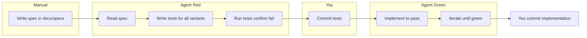

# Spec-First TDD Workflow

This document describes the three-step development workflow: (1) human-authored spec, (2) agent-generated tests from the spec, (3) agent-driven TDD. The spec is the single source of truth for what the tests must cover.

---

## Step 1 — Create the spec (manual)

A great spec defines not only functional requirements but **how those requirements will be tested**: edge cases, input-output pairs, and success criteria. That gives the agent everything it needs to produce meaningful tests and exactly the coverage you want.

1. Create or edit a spec file in **`docs/specs/`**.
2. Use the template: [docs/specs/SPEC-TEMPLATE.md](specs/SPEC-TEMPLATE.md).
3. Fill in:
   - **Contract** — Function/module name, signature, and file location.
   - **Input / Output** — Every pair or table row you want tested (the agent will generate tests from these).
   - **Edge cases** — Empty, null, boundaries, Unicode, etc.
   - **Error cases** — Invalid types, preconditions, throws/errors.
   - **Invariants** — e.g. pure function, no side effects.
   - **Success criteria** — How this will be tested: pass conditions, what must be covered.
   - **Test file hint (optional)** — Where the agent should put the test file.

Naming: `spec-<feature>.md` or `YYYY-MM-DD_HH-MM-spec-<name>.md` (timestamp per project docs rule).

---

## Step 2 — Agent writes tests from spec

1. Point the agent at the spec, e.g.:
   - *"Write tests from `docs/specs/spec-validateEmail.md` covering all variants. TDD: do not implement yet; tests must fail."*
2. The agent will:
   - Read the spec file.
   - Write tests for **every** input/output pair, edge case, and error case listed.
   - Use existing patterns in [tests/](../tests/) and [TDD-PLAN-AND-WORKFLOW.md](TDD-PLAN-AND-WORKFLOW.md) (§4–5).
   - **Not** write implementation or mocks (Red phase only).
3. Run the tests and confirm they fail for the right reason (e.g. function not defined or wrong return value).

---

## Step 3 — Agent does TDD

Follow [TDD-PLAN-AND-WORKFLOW.md](TDD-PLAN-AND-WORKFLOW.md) for phases B–F:

1. **Confirm red** — Tests run and fail. Do not write implementation in this step.
2. **Commit tests** — You commit the test file(s), e.g. `test: add tests for X (TDD red phase)`.
3. **Green** — Ask the agent: *"Implement to pass all tests in [path]. Do not modify the tests. Iterate until all tests pass."*
4. **Commit implementation** — When all tests pass, commit the implementation, e.g. `feat: implement X to pass tests`.
5. **Refactor (optional)** — Refactor for clarity/performance; tests stay green; commit separately if non-trivial.

---

## Flow diagram

---

## Quick reference

| Step | Who | Action |
|------|-----|--------|
| 1 | You | Create/edit spec in `docs/specs/` using [SPEC-TEMPLATE.md](specs/SPEC-TEMPLATE.md). |
| 2a | Agent | Read spec; write tests for all variants; do not implement. |
| 2b | Agent | Run tests; confirm they fail. |
| 2c | You | Commit tests (red phase). |
| 3a | Agent | Implement to pass all tests; do not change tests; iterate until green. |
| 3b | You | Commit implementation. |

---

## See also

- [TDD-PLAN-AND-WORKFLOW.md](TDD-PLAN-AND-WORKFLOW.md) — Phases A–F, example prompts, test layout.
- [.cursor/rules.md](../.cursor/rules.md) — "Spec-first TDD" subsection for agent behavior.
- [.cursor/commands/tdd.md](../.cursor/commands/tdd.md) — Command to start spec-first TDD.
