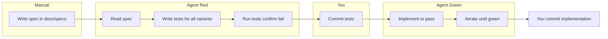
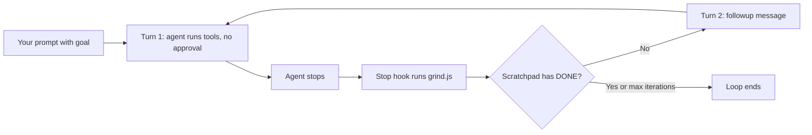

# Spec-First TDD and Long-Running Agent Workflow

This document explains the **spec-first, TDD development workflow** as set up in the VibeSwitch extension, the **automation mechanisms** that implement it, and how the setup keeps **agent work cycles long and effective** with **minimal approvals** from you.

---

## 1. Introduction and goals

### Spec-first TDD

The single source of truth is a **human-authored spec** in `docs/specs/`. The agent generates tests from it (Red phase), then implements to pass those tests (Green phase) after you commit the tests. The spec defines not only behavior but how it will be tested, so the agent produces exactly the coverage you want.

### Long cycles, few approvals

The setup is designed so the agent can run **many turns** (edit, run tests, fix, repeat) and only stop when a **goal is met** (e.g. all tests pass) or a **max iteration count** is reached—without you approving each step or saying "continue." Automation (rules, stop hook, scratchpad, skills) makes this possible.

---

## 2. The spec-first TDD workflow (three steps)

### Step 1 — Human writes the spec

- **Location:** `docs/specs/`. Use the template: [docs/specs/SPEC-TEMPLATE.md](specs/SPEC-TEMPLATE.md).
- **Sections to fill in:**
  - **Contract** — Name, signature/API, and file location of the unit under test.
  - **Input / Output** — Every input→output pair or table row you want tested (the agent will generate tests from these).
  - **Edge cases** — Empty, null, boundaries, Unicode, duplicates, etc.
  - **Error cases** — Invalid types, preconditions, what throws or returns an error.
  - **Invariants** — e.g. pure function, no side effects, idempotent.
  - **Success criteria** — How this will be tested: pass conditions, what must be covered.
  - **Test file hint (optional)** — Where the agent should put the test file (e.g. `tests/lib/validateEmail.test.js`).

**Principle:** A great spec defines not only functional requirements but **how those requirements will be tested**. That gives the agent everything it needs to produce meaningful tests and the coverage you want.

Naming: `spec-<feature>.md` or `YYYY-MM-DD_HH-MM-spec-<name>.md` (timestamp per project docs rule).

**Automated option — `/spec` command:** Instead of filling the template manually, you can type **`/spec`** in Cursor chat followed by a short free-form description of the module or functionality (e.g. `/spec validate email addresses: valid format true, invalid false, empty false`). The agent will create and fill a spec file in `docs/specs/` from that description. You then **peruse and improve** the spec if needed before using `/tdd` with the spec path. See [.cursor/commands/spec.md](../.cursor/commands/spec.md).

### Step 2 — Agent writes tests (Red only)

1. Point the agent at the spec (e.g. "Write tests from `docs/specs/spec-validateEmail.md` covering all variants. TDD: do not implement yet; tests must fail.") or use the TDD command with the spec path.
2. The agent will:
   - Read the spec file.
   - Write tests for **every** input/output pair, edge case, and error case listed.
   - Use existing patterns in [docs/TDD-PLAN-AND-WORKFLOW.md](TDD-PLAN-AND-WORKFLOW.md) (§4–5) and the test layout (`tests/**/*.test.js` or `business_modules/<module>//__tests__/<name>.test.js`).
   - **Not** write implementation or mocks for the behavior under test (Red phase only).
3. Run the tests and confirm they fail for the right reason (e.g. function not defined or wrong return value).

**Optional — Judge coverage before Green:** You can use an LLM to judge whether tests adequately cover the spec, and optionally suggest more edge/corner cases:

- `npm run suggest-spec-cases -- --spec docs/specs/spec-foo.md --output docs/specs/suggested-foo.md`
- `npm run judge-spec-coverage -- --spec docs/specs/spec-foo.md --tests tests/ --suggested-cases docs/specs/suggested-foo.md --output report.md`

See [scripts/README.md](../scripts/README.md) and [docs/2026-02-19_17-38-spec-first-tdd-workflow.md](2026-02-19_17-38-spec-first-tdd-workflow.md) for details.

### Step 3 — Commit tests, then Green

1. **You commit** the test file(s), e.g. `test: add tests for X (TDD red phase)`.
2. Ask the agent to implement to pass all tests (e.g. "Implement to pass all tests in [path]. Do not modify the tests. Iterate until all tests pass.").
3. Agent implements, runs tests, iterates until green.
4. **You commit** the implementation, e.g. `feat: implement X to pass tests`.
5. **Refactor (optional):** Refactor for clarity/performance with tests staying green; commit separately if non-trivial.

### Flow diagram

Full three-step narrative: [docs/2026-02-19_17-38-spec-first-tdd-workflow.md](2026-02-19_17-38-spec-first-tdd-workflow.md).

---

## 3. Automation mechanisms

Each mechanism and where it lives:

| Mechanism | Purpose | Location / how to use |
|-----------|---------|------------------------|
| **Cursor rules** | VIBE MODE (no approval for edits/terminal/search); grind loop behavior; spec-first TDD and strict TDD phases; packaging rule; verification policy | [.cursor/rules.md](../.cursor/rules.md) |
| **tests-from-spec skill** | When user points at a spec: read spec → write tests for all variants (Red only) → confirm fail → after user commits, implement (Green) | [.cursor/skills/tests-from-spec/SKILL.md](../.cursor/skills/tests-from-spec/SKILL.md) |
| **enforce-grind-hook skill** | Enforce grind-by-default: task with goal → don't write DONE until goal met then write DONE; one-off Q → answer then DONE | [.cursor/skills/enforce-grind-hook/SKILL.md](../.cursor/skills/enforce-grind-hook/SKILL.md) |
| **spec command** | In chat: `/spec` + short free-form description → agent creates and fills a spec in `docs/specs/`; you peruse/improve then use `/tdd` | [.cursor/commands/spec.md](../.cursor/commands/spec.md) |
| **TDD command** | In chat: `/tdd` then replace `[path-to-spec]`; injects spec-first TDD instruction (read spec, Red, then Green after commit) | [.cursor/commands/tdd.md](../.cursor/commands/tdd.md) |
| **Stop hook (grind)** | Runs after each agent turn; reads scratchpad; returns `followup_message` to continue or `{}` to stop | [.cursor/hooks.json](../.cursor/hooks.json), [.cursor/hooks/grind.js](../.cursor/hooks/grind.js) (and [.cursor/hooks/grind.ts](../.cursor/hooks/grind.ts) for Bun) |
| **Scratchpad** | `.cursor/scratchpad.md`; "DONE" signals goal met so grind script stops the loop | [.cursor/scratchpad.md.example](../.cursor/scratchpad.md.example) |
| **VibeSwitch: Open Agent Loop Scratchpad** | Creates/opens scratchpad, reminds to write DONE when goal is met | Command Palette → "Open Agent Loop Scratchpad" (implementation: [vsCommandsFactory.js](../vsCommandsFactory.js) — `openAgentLoopScratchpad`) |
| **VibeSwitch: Install Grind Script to VibeSwitch Hooks** | Copies `.cursor/hooks/grind.js` to `~/.vibeswitch/hooks/grind.js` for use from any workspace | Command Palette → "Install Grind Script to VibeSwitch Hooks" (implementation: vsCommandsFactory.js — `installGrindHook`) |
| **judge-spec-coverage / suggest-spec-cases** | Optional: suggest edge cases from spec; judge whether tests cover spec (and suggested cases) | `npm run suggest-spec-cases`, `npm run judge-spec-coverage` — [scripts/README.md](../scripts/README.md), [docs/2026-02-19_17-38-spec-first-tdd-workflow.md](2026-02-19_17-38-spec-first-tdd-workflow.md) |

### Stop hook contract (grind script)

- **Input (stdin):** Cursor passes one JSON object: `{ "conversation_id", "status", "loop_count" }`.
- **Output (stdout):** Script prints a single JSON line. If it prints `{ "followup_message": "..." }`, Cursor starts a **new** agent turn with that message. If it prints `{}` or nothing, the loop ends.
- **Grind script logic:**
  - If `status !== "completed"` or `loop_count >= GRIND_MAX_ITERATIONS` (default 5) → output `{}` (loop ends).
  - Else read the scratchpad file (default `.cursor/scratchpad.md`). If it **contains** the word `DONE` → output `{}` (loop ends). Otherwise → output `{ "followup_message": "[Iteration N/M] Continue working. Update .cursor/scratchpad.md with DONE when complete." }`.
- **Environment variables:**
  - `GRIND_MAX_ITERATIONS` — Max follow-up turns (default `5`).
  - `GRIND_SCRATCHPAD` — Full path to the scratchpad file (default `.cursor/scratchpad.md`).

Verification and step-by-step usage: [docs/AGENT-LOOP-STOP-HOOK.md](AGENT-LOOP-STOP-HOOK.md), [docs/2026-02-19_17-08-agent-loop-stop-hook-detailed-guide.md](2026-02-19_17-08-agent-loop-stop-hook-detailed-guide.md). Hook script README: [.cursor/hooks/README.md](../.cursor/hooks/README.md).

---

## 4. How agent work cycles stay long and effective (minimal approvals)

### VIBE MODE (rules)

The agent is instructed **not to ask for approval** for normal actions: edits (single or multi-file), creating/editing files, **running search** (grep, semantic search), **running terminal commands** (tests, lint, package, git status/diff, npm scripts). It runs them. Only **destructive or irreversible** actions (delete important files, deployments, destructive DB migrations) require asking first. So **within a turn**, the agent can run many operations without stopping for your OK.

### Run Everything (Cursor setting)

You turn off "Require approval for terminal" / "Require approval for tools" in Cursor (Settings → Features / Agent). The IDE then does not prompt you for each command or tool use. Combined with VIBE MODE, the agent can execute freely inside each turn.

### Stop hook + grind script

**Yes — it runs automatically.** When the stop hook is configured in `.cursor/hooks.json` (as in this repo), Cursor invokes it **after every agent turn**, with no action required from you. The grind script runs; if it returns a `followup_message` (scratchpad does not contain `DONE` and iteration count is under the max), Cursor **automatically starts the next turn**. So at each interaction: turn ends → hook runs → next turn may start without you saying "continue." The loop continues until the scratchpad contains `DONE` or max iterations (e.g. 5) is reached, so multi-step goals (e.g. "run tests and fix until all pass") can run for several turns with no further input from you.

### Grind-by-default (rules + skill)

The agent is instructed to treat **tasks with a verifiable goal** (fix bug, add feature, run tests until pass, make lint clean) as a grind: **do not** write `DONE` in `.cursor/scratchpad.md` until the goal is actually met; then write `DONE` so the stop hook stops the loop. For **one-off questions** (explain, what is, how), the agent answers fully and then writes `DONE` so the loop does not unnecessarily continue. So the same loop is used consistently without a special prompt every time.

### Verification and packaging (rules)

- When tests exist and could be affected, the agent runs `npm test`.
- After each significant code change, the agent must re-package: run `npm test` (if relevant), then `npm run package`, and report the generated `.vsix` path so you can install it.

So the agent **proves correctness** and **delivers an installable build** without extra approval steps.

### Task / plan discipline (rules)

The agent is instructed to plan in `tasks/todo.md`, track progress, and update `tasks/lessons.md` after corrections. That keeps the agent focused and self-correcting across turns.

### End-to-end loop (diagram)

---

## 5. Quick reference

- **Key files:** `.cursor/rules.md`, `.cursor/hooks.json`, `.cursor/hooks/grind.js`, `.cursor/scratchpad.md`, `docs/specs/SPEC-TEMPLATE.md`, `docs/TDD-PLAN-AND-WORKFLOW.md`, `docs/2026-02-19_17-38-spec-first-tdd-workflow.md`.
- **Commands:** VibeSwitch: Open Agent Loop Scratchpad; VibeSwitch: Install Grind Script to VibeSwitch Hooks; **`/spec`** — create spec from short description (see [.cursor/commands/spec.md](../.cursor/commands/spec.md)); **`/tdd`** — see below.
- **Env vars:** `GRIND_MAX_ITERATIONS` (default 5), `GRIND_SCRATCHPAD` (default `.cursor/scratchpad.md`).
- **See also:** [docs/AGENT-LOOP-STOP-HOOK.md](AGENT-LOOP-STOP-HOOK.md), [docs/2026-02-19_17-08-agent-loop-stop-hook-detailed-guide.md](2026-02-19_17-08-agent-loop-stop-hook-detailed-guide.md), [.cursor/hooks/README.md](../.cursor/hooks/README.md).

### TDD command (with spec path)

The **TDD command** is a Cursor command defined in [.cursor/commands/tdd.md](../.cursor/commands/tdd.md). It injects a single instruction that tells the agent to run the full spec-first TDD workflow for a given spec file.

**How to use it:**

1. **In Cursor chat, type `/tdd`** (slash plus the command name). Cursor exposes files in `.cursor/commands/` as slash commands, so `tdd.md` is available as `/tdd`. You can also open the command via the command list that uses `.cursor/commands/`.
2. **Replace the placeholder `[path-to-spec]`** in the injected message with the actual path to your spec file. Examples:
   - `docs/specs/spec-validateEmail.md`
   - `docs/specs/2026-02-03_17-59-event-signal-weight-meters-spec.md`
3. Send the resulting message. The agent will:
   - Read the spec at that path.
   - Write tests for every input/output pair, edge case, and error case (Red phase); run tests and confirm they fail.
   - After you commit the tests, implement to pass all tests without changing them (Green phase).

You can also trigger the same workflow by typing a sentence that points at the spec (e.g. *"Write tests from `docs/specs/spec-validateEmail.md` covering all variants. TDD: do not implement yet."*); the TDD command is a reusable template so you don’t have to remember the exact wording.
