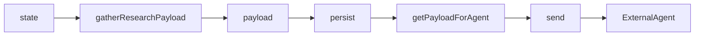
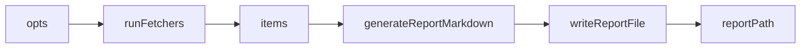

# Spec: Research business module

Research business module for the Vibeswitch extension: (1) ingest pipeline — gather objective code-quality data from extension state, persist to local SQLite, and POST current + history to an external research agent on a poll interval; (2) daily research — run parallel fetchers (arXiv, Medium, LinkedIn, X), aggregate normalized items, and write a Markdown daily report to `reportsDir/YYYY-MM-DD.md`.

**Principle:** A great spec defines not only functional requirements but **how those requirements will be tested**. Include edge cases, input-output pairs, and success criteria. That gives the agent everything it needs to produce meaningful tests—and you get exactly what you want covered.

---

## Contract

- **Name:** Research module — application services and ports for ingest (gather → persist → send to agent) and daily research (fetchers → report).
- **Signature / API:**
  - **Flow 1 — Ingest:**
    - `gatherResearchPayload(state): Promise<ResearchPayload>` — builds payload from extension state (timestamp, source, scoreData, antipatternBreakdown, tokenUsage, sonarMeasures, eslintMeasures, projectProgressMeasures, currentMode); missing clients yield null for that field.
    - `createResearchDataService(opts): { start(), stop(), gatherResearchPayload }` — opts: `getAgentUrl`, `getApiKey?`, `getDbPath?`, `pollIntervalMs?`, `lastDays?`, `lastN?`, `loggerPort?`. On poll: gather → persist (if getDbPath) → getPayloadForAgent (if store) → send to agent (if URL set). When agent URL missing/empty, skip send. When no DB path, persist skipped; only current payload sent.
    - **IResearchPersistencePort:** `persist(payload): Promise<void>`; `getPayloadForAgent({ lastDays, lastN }): Promise<{ current: ResearchPayload|null, history: ResearchPayload[] }>`.
    - **IResearchAgentPort:** `send(payload): Promise<{ ok: boolean, status?: number, error?: string }>`.
  - **Flow 2 — Daily research:**
    - Fetchers: each returns `Promise<Array<NormalizedItem>>` where `NormalizedItem = { title, link, summary, source, date }`. `runFetchers(opts)` runs all (arXiv, Medium, LinkedIn, X) in parallel and concatenates. Options: `fetchFn?`, `getXBearerToken?`, `getLinkedInApiKey?`, `arxivMaxResults?`, `mediumMaxItems?`, `xUsernames?`, `xMaxPerUser?`.
    - `generateReportMarkdown(items, dateStr): string` — Markdown string grouped by source (arxiv, medium, linkedin, x).
    - `writeReportFile(reportsDir, dateStr, content): string` — writes file, returns path.
    - `generateDailyReport(items, reportsDir, dateStr?, opts?): string` — generates markdown and writes file; returns path. Invalid dateStr → use today.
    - Daily research runner: `run(): Promise<{ reportPath: string, itemCount: number }>`; `runFetchers(opts)` exposed for tests. Options: `reportsDir`, `dateStr?` (default today), and fetcher opts.
- **Location:**
  - **No input layer** — module is only called in-process from composition root; app service (and daily research runner) are the entry points.
  - App: `business_modules/research/app/researchService.js` (or `ResearchDataService.js`), and daily research runner (e.g. `app/dailyResearchRunner.js` or under `researchReview/`); report generator in app or dedicated file.
  - Domain: `business_modules/research/domain/ports/IResearchPersistencePort.js`, `IResearchAgentPort.js`, fetcher/report ports as needed; value objects for payload and NormalizedItem.
  - Infrastructure: `business_modules/research/infrastructure/adapters/` — e.g. `researchSqlitePersistenceAdapter.js`, `researchAgentClientAdapter.js`, `researchArxivFetcherAdapter.js`, `researchMediumFetcherAdapter.js`, `researchLinkedInFetcherAdapter.js`, `researchXFetcherAdapter.js`, `researchReportWriterAdapter.js` (or equivalent). Current code may live in `infrastructure/ResearchStore.js`, `infrastructure/ResearchAgentClient.js`, `researchReview/fetchers/`, `researchReview/reportGenerator.js`; refactoring to strict ports/adapters is optional follow-up.

---

## Naming (optional)

- **Function / module / API:** camelCase for functions and file names; PascalCase for domain types.
- **Parameters and options:** camelCase: `gatherResearchPayload`, `createResearchDataService`, `runFetchers`, `generateDailyReport`, `reportsDir`, `dateStr`, `ResearchPayload`, `NormalizedItem`.
- **Business module:** File names camelCase. Domain: PascalCase for value objects. Ports: `IResearchPersistencePort`, `IResearchAgentPort`, etc. Adapters: `research*Adapter.js` in `infrastructure/adapters/`. See `.cursor/skills/create-business-module/SKILL.md` for the full naming table.

---

## Business module (optional)

- **Module name:** `research`
- **Layers:**
  - **Input:** Omitted — module is only called in-process; app service and daily research runner are the entry points.
  - **App:** Research data service (orchestrates gather, persist, send; start/stop poller); daily research runner (orchestrates fetchers + report write). Optional controller in app if needed for a single entry that delegates to both.
- **Domain model (DDD):**
  - **Entities:** None required for this spec.
  - **Value objects:** Research payload shape: `{ timestamp, source, scoreData?, antipatternBreakdown?, tokenUsage?, sonarMeasures?, eslintMeasures?, projectProgressMeasures?, currentMode? }` (null for missing clients). NormalizedItem: `{ title, link, summary, source, date }`.
  - **Ports:**
    - **IResearchPersistencePort** — persist payloads and read for agent. Methods: `persist(payload): Promise<void>`, `getPayloadForAgent({ lastDays, lastN }): Promise<{ current, history }>`. Implemented by SQLite store adapter (e.g. `researchSqlitePersistenceAdapter.js`); tables `ingest_payloads` + optional `sonar_snapshots`.
    - **IResearchAgentPort** — send payload to external agent. Method: `send(payload): Promise<{ ok, status?, error? }>`. Implemented by HTTP client adapter (e.g. `researchAgentClientAdapter.js`); POST to `baseUrl/ingest`, optional Bearer API key.
    - **Fetchers** — each returns `Promise<Array<NormalizedItem>>`. Can be one port per source or a composite; implementors use one adapter per source (arXiv, Medium, LinkedIn, X).
    - **IResearchReportWriterPort** (or pure + FS) — `generateReportMarkdown(items, dateStr)` returns string; `writeReportFile(reportsDir, dateStr, content)` returns path. Implemented by FS adapter or pure functions + FS in adapter.
- **Infrastructure adapters:** State payload (if ported), SQLite persistence, HTTP agent client, arXiv/Medium/LinkedIn/X fetchers, FS report writer. Naming: `research*Adapter.js` in `infrastructure/adapters/`.

---

## Input / Output (and behavior)

### Ingest pipeline

| Input | Expected output / behavior |
|-------|-----------------------------|
| `gatherResearchPayload(state)` with state containing `awarenessEngine`, `tokenUsageClient`, `sonarClient`, `eslintClient`, `projectProgressClient`, `getMode`/`currentMode` | Payload with all fields set from respective clients (scoreData from `getScore()`, antipatternBreakdown from `getAntipatternBreakdownAsync()` or `getAntipatternBreakdown()`, etc.); timestamp and source set. |
| `gatherResearchPayload(null)` or missing state | Payload with timestamp, source, currentMode default (e.g. 'dev'); scoreData, antipatternBreakdown, tokenUsage, sonarMeasures, eslintMeasures, projectProgressMeasures all null. No throw. |
| `gatherResearchPayload(state)` with only `awarenessEngine` present | scoreData and antipatternBreakdown set; tokenUsage, sonarMeasures, eslintMeasures, projectProgressMeasures null. |
| `IResearchAgentPort.send(payload)` when agent baseUrl is missing or empty | `{ ok: false, error: "..." }` (e.g. "Research agent URL not configured"). No throw. |
| `IResearchPersistencePort.getPayloadForAgent({ lastDays, lastN })` when store has no rows | `{ current: null, history: [] }`. |
| `createResearchDataService(opts)` with no `getDbPath` | On tick: gather payload; no persist; send `{ current: payload, history: [] }` to agent if URL set. |
| `createResearchDataService(opts)` with `getDbPath` and URL set | On tick: gather → persist → getPayloadForAgent → send `{ current, history }`. start()/stop() idempotent for already started/stopped. |

### Daily research

| Input | Expected output / behavior |
|-------|-----------------------------|
| `runFetchers(opts)` with valid opts (e.g. fetchFn, optional tokens) | Promise resolves to array of NormalizedItem (concatenation of all fetcher results); each item has title, link, summary, source, date. |
| `generateDailyReport(items, reportsDir, dateStr)` with non-empty items | File written at `reportsDir/dateStr.md`; content is Markdown with header and items grouped by source (arxiv, medium, linkedin, x); returns path. |
| `generateDailyReport([], reportsDir, dateStr)` | File still written with header only; returns path. |
| `generateDailyReport(items, reportsDir, invalidDateStr)` (e.g. malformed) | Use today for path and content; returns path. |
| Daily research runner `run()` | Runs fetchers, then generateDailyReport; returns `{ reportPath, itemCount }`. |
| Fetcher when fetchFn missing or network error | Returns `[]` (empty array); no throw. |

---

## Edge cases and corner cases

- **Ingest:** State null or missing clients → payload fields null. Agent URL empty → send returns ok false. getPayloadForAgent with no data → current null, history []. Optional opts (pollIntervalMs, lastDays, lastN) missing → use documented defaults (e.g. 5 min, 7 days, 50 rows). start() called when already started → no-op. stop() when already stopped → no-op.
- **Daily research:** Empty items → report file written with header only. Invalid dateStr → use today. Missing fetchFn or fetcher failure → fetcher returns []. All fetchers fail → runFetchers returns []; report still written with header only.

---

## Error cases

- **Ingest:** State null or missing clients → no throw; payload fields null. Agent URL missing/empty → send returns `{ ok: false, error: "..." }`, no throw. Persistence or network errors in tick → logged via loggerPort if provided; no unhandled throw to caller of start/tick.
- **Daily research:** Invalid dateStr → fallback to today, no throw. Fetcher errors → return [] for that fetcher. writeReportFile FS errors → propagate or return/throw per implementation; spec: document that FS errors may throw.

---

## Invariants

- **Ingest:** start()/stop() are idempotent (calling start when already started does nothing; stop when already stopped does nothing). send() never throws; returns result object. gatherResearchPayload with same state shape produces payload with same structure; null for missing clients.
- **Daily research:** For given items and dateStr, generateReportMarkdown produces deterministic Markdown. Report file path is `reportsDir/YYYY-MM-DD.md`. Empty items still produce a valid report file (header only).

---

## Success criteria (how this will be tested)

- **Pass:** All input/output pairs in the tables above pass. Ingest: state null or partial state yields payload with nulls; agent URL empty yields send ok false; getPayloadForAgent with no data yields current null, history []. Daily: empty items yield report with header only; invalid dateStr yields today; run() returns reportPath and itemCount. No unhandled throw for the listed error cases.
- **Coverage:** Every row in Input/Output; edge cases (null state, empty URL, no store data, empty items, invalid dateStr); port methods called with expected arguments when mocked.
- **Test fails when:** gatherResearchPayload throws on null state; send throws instead of returning result; getPayloadForAgent throws with no data; generateDailyReport throws on empty items; or a port is invoked with wrong arguments.

---

## Test levels (optional)

- **Unit (default):** Research data service with mocked IResearchPersistencePort and IResearchAgentPort; cover all ingest I/O rows, edge and error cases; verify gatherResearchPayload returns correct shape for state variants; verify start/stop and tick behavior. Daily research runner with mocked fetchers and report writer; cover runFetchers aggregation, generateDailyReport with empty/non-empty items and invalid dateStr. Report generator (generateReportMarkdown, writeReportFile) with mocked FS. Adapter tests: persistence adapter with temp SQLite or mocked sql.js; agent adapter with mocked fetch; fetchers with mocked fetchFn.
- **Integration (optional):** Service + real SQLite persistence adapter (temp dir); assert persist then getPayloadForAgent. Daily runner + real report writer (temp dir); assert file path and content. No real network for agent or fetchers in integration unless explicitly required.
- **E2E:** Not required for this spec.

---

## Test file hint (optional)

- **Unit (ingest):** `tests/business_modules/research/app/ResearchDataService.test.js` (or `researchService.test.js` if renamed)
- **Unit (daily research):** `tests/business_modules/research/app/dailyResearchRunner.test.js` (or under path matching researchReview if kept)
- **Unit (report generator):** `tests/business_modules/research/app/reportGenerator.test.js` or under researchReview
- **Unit (adapters):** `tests/business_modules/research/infrastructure/adapters/researchSqlitePersistenceAdapter.test.js`, `researchAgentClientAdapter.test.js`, `researchArxivFetcherAdapter.test.js` (and Medium, LinkedIn, X as needed), `researchReportWriterAdapter.test.js` (if applicable)

---

## Diagrams (optional)

